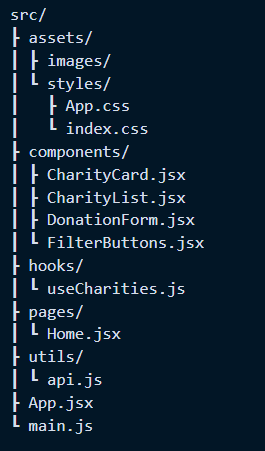

# SBA 320H - The Bones of a Cool Donation Site - Working with Colorado 501(c)(3) Data 
## A React Web Application Project

# Technologies Used

- **HTML**: Used for structuring the content of the web application.
- **CSS**: Used for styling the web application, including layout, colors, and fonts.
- **JavaScript**: Used for adding interactivity and functionality to the web application.
- **React**: A JavaScript library for building user interfaces. Used to create the components and manage the state of the application.
  - **useContext**: A React hook used for managing global state across the application.
  - **useReducer**: A React hook used for managing complex state logic in the application.
- **Fetch API**: Used to make asynchronous requests to the external data source (Colorado Non-Profit Data API) and retrieve data.
- **LocalStorage**: Used to store donor information in the user's browser.
- **GitHub**: Used for version control and collaboration. Frequent commits were made to track the progress of the project.
- **Netlify**: Used for hosting the web application and making it accessible online.

# Requirements
Your application must meet these requirements to pass (this it your Minimum Viable Product):

- [X] Built with HTML, CSS, JavaScript, REACT (useContext and/or useReducer hooks).
- [X] Hosted on Heroku or Netlify.
- [X] Frequent commits to GitHub.
- [X] A README.md file in your GitHub repository with:
    - [X] Explanations of the technologies used.
    - [X] Explanations of the approach taken.
    - [X] A link to your live site.
    - [ ] Usage instructions, if relevant.
    - [X] Unsolved problems.
- [X] Use AJAX to make a request to an external data source like OMDBapi, and insert some of the data retrieved into the DOM.

## Usage Instructions
Explore nonprofits available through the Colorado Non-Profit Data API. Click on a nonprofit to view more details. Use the placeholder donation feature to simulate a donor interaction.

## Bonus Features
The following are not required:

- [ ] Have one or more complex user interface modules such as a carousel, drag and drop, a sticky nav, tooltips, etc.
- [X] Look into localstorage so you can save data to the user's browser.

## Approach

I investigated several APIs, checked their endpoints, and allowed the data to shape what the application would become. I then started to set up my original App.jsxfile. (I worked with a different API for a couple of days but found its data disappointing. I then switched to the State of Colorado API and created my ColoradoApi.jsfile.)

I referenced the React Documentation, watched multiple YouTube videos, and utilized online tutorials to get the data flowing. The original files for the old API were retained in case the new setup failed.

While my ultimate goal was to set up a donation site with Stripe integration, my focus for this iteration was on meeting the MVP requirements. I prioritized building a functional structure and experimenting with LocalStorage to enhance user experience by saving data locally in their browser.

## Unsolved Problems

The donation component is currently a placeholder and does not handle real transactions yet. The intention was to implement this feature with Stripe, but time was allocated to meet MVP requirements first.

Grouping nonprofits more intelligently may require switching to a different API or additional filtering logic.

While I can implement features using documentation, I aim to improve my ability to write components from scratch. My next step is to practice building smaller projects that focus on React fundamentals to solidify my skills.

## Live Site

You can view the live site here: [Easy Philanthropy](https://incomparable-flan-935910.netlify.app/)

### Notes on finding an API 
[Finding an API](https://ps-react-curriculum.herokuapp.com/320/project/#-finding-an-api)
